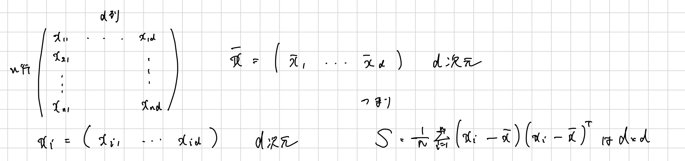

# 主成分分析

教師なし学習の 1 つで, 次元圧縮の手法である.
PCA は与えられたデータをより低次元空間に射影し, 射影後の点の散らばりができるだけ大きくなるようにする.

つまり, **元データの特徴を最もよく捉えた射影を見つける**ということにあたる.

次元圧縮後のデータの分散を最大化することを考える.
まずは 1 次元に射影する場合を考える.
射影する先のベクトルを $\bm{w}_1$ とする. また, 射影先のベクトルの大きさに意味はないので $\|\bm{w}_1\|=1$ と仮定. つまり

$$
\bm{w}_{1}^T\bm{w}_1=1
$$

また, データ $\lbrace \bm{x}_i \rbrace_{i=1}^{n}$ の平均を $\bar{\bm{x}}$ とする. つまり

$$
\bar{\bm{x}} = \frac{1}{n}\sum_{i=1}^{n}x_i
$$

このとき, $\lbrace \bm{w}_1^T\bm{x}_i \rbrace_{i=1}^{n}$ の平均を計算すると

$$
\frac{1}{n}\sum_{i=1}^{n}\bm{w}_1^T\bm{x}_i = \frac{1}{n}\bm{w}_1^T\sum_{i=1}^{n}\bm{x}_i = \bm{w}_1^T\bm{\bar{x}}
$$

分散を計算すると

$$
\frac{1}{n}\sum_{i=1}^{n}\|\bm{w}_1^T\bm{x}_i - \bm{w}_1^T\bar{\bm{x}}\|^2
$$

ここで、$\|\bm{a}\|^2 = \bm{a}^T\bm{a}$ を使って、式を展開.
$\bm{w}_1^T\bm{x}_i$ および $\bm{w}_1^T\bar{\bm{x}}$ はスカラーであるため,

$$
\|\bm{w}_1^T\bm{x}_i - \bm{w}_1^T\bar{\bm{x}}\|^2 = (\bm{w}_1^T\bm{x}_i - \bm{w}_1^T\bar{\bm{x}})^2
$$

うまく変形すると

$$
\frac{1}{n}\sum_{i=1}^{n}\lbrace \bm{w}_1^T(\bm{x_i-\bar{x}}) \rbrace \lbrace (\bm{x_i-\bar{x}})^T\bm{w}_1 \rbrace
$$

$$
= \bm{w}_1^T \left\{ \frac{1}{n}\sum_{i=1}^{n}(\bm{x_i-\bar{x}})(\bm{x_i-\bar{x}})^T\right\}\bm{w}_1
$$

ここで $\frac{1}{n}\sum_{i=1}^{n}(\bm{x_i-\bar{x}})(\bm{x_i-\bar{x}})^T$ は $\bm{x}_i$ の共分散行列である.

この共分散行列を $\bm{S}$ とおくと, $\bm{S}$ は $d \times d$ 行列になる.

よって解くべき最適化問題は

$$
\text{Maximize} \space \bm{w}_1^T\bm{Sw_1} \\
\space\\
\text{Subject to } \space \bm{w}_1^T\bm{w}_1 = 1
$$

上記の最適化問題をラグランジュ未定乗数法で解くために以下のような関数を定義する.

$$
\phi(\bm{w}_1, \lambda_1) = \frac{1}{2}\bm{w}_1^T\bm{Sw_1} - \frac{1}{2}\lambda_1(\bm{w}_1^T\bm{w}_1 - 1)
$$

ここで $\frac{1}{2}$ は計算の便宜上つけた係数である.
$\phi$ を $\bm{w}_1$ について勾配をとって=0 とおく.

$$
\frac{\partial{\phi}}{\partial{\bm{w}_1}} = S\bm{w}_1 - \lambda_1\bm{w}_1 = 0
$$

つまり, $\lambda_1$ は $\bm{S}$ の固有値となる.
これが満たされる時は $\bm{w}_1^T\bm{Sw_1} = \bm{w}_1^T\lambda_1\bm{w_1} = \lambda_1$ であるので, 目的関数を最大化するためには $\lambda_1$ を最大化する必要がある.

つまり, 固有値が最大のものを見つけるということに帰着する.

## 多次元への射影と特異値分解

以上は 1 次元ベクトルへの射影の場合だが, 一般に c 次元部分空間に圧縮するためには, 同じような議論により固有値を大きい順に c 個 $\lambda_1, \lambda_2, \dots \lambda_c$ を選び, それに対応する固有ベクトル $\bm{w}_1, \bm{w}_2, \dots, \bm{w}_c$ を利用すればいい.

$\bm{w}_1, \bm{w}_2, \dots, \bm{w}_c$ が決まった時に, この方向に $\bm{x}_1, \bm{x}_2, \dots, \bm{x}_c$ を射影することで次元圧縮を得るが, 射影されるベクトルを $z$ とする.
つまり, 訓練データ $\bm{X}$ の射影後の分散を最大にする方向に一般のベクトル $z$ を射影するということを考えることは可能.

$\bm{w}_1, \bm{w}_2, \dots, \bm{w}_c$ は全て単位行列で互いに直交するため, それぞれ新しい座標軸と考えられる.

元の空間ベクトル $z$ から ある基底への射影は, 第 $j$ 成分が $\bm{w}_j$ への射影の大きさとみなすことができる.
つまり, $\bm{w}_j^T$ を縦に並べた行列を $\bm{W}^{(c)}$ とおく.

すると, z の射影は以下のようになる.

$$
\begin{pmatrix}
    \bm{w}_1^Tz \\
    \bm{w}_2^Tz \\
    \vdots \\
    \bm{w}_c^Tz
\end{pmatrix}
= \bm{W}^{(c)}z
$$

ここで $c=d$ であるから $\bm{W} = (\bm{w}_1, \bm{w}_2, \dots, \bm{w}_d)$

$$
\frac{\partial{\phi}}{\partial{\bm{w}_1}} = S\bm{w}_1 - \lambda_1\bm{w}_1 = 0
$$

これを変形すると

$$
\bm{SW} = \bm{W\Lambda}
$$

ここで $\Lambda$ は以下で定義される.

$$
\bm{\Lambda} =
\begin{pmatrix}
    \lambda_1 \\
    & \lambda_2 \\
    & & \ddots \\
    & & & \lambda_d
\end{pmatrix}
$$

$W$ が直交行列であるため

$$
S = \bm{W\Lambda W^{-1}} = \bm{W\Lambda W^{T}}
$$

このアルゴリズムを実装するために特異値分解を用いる.

## まとめ
