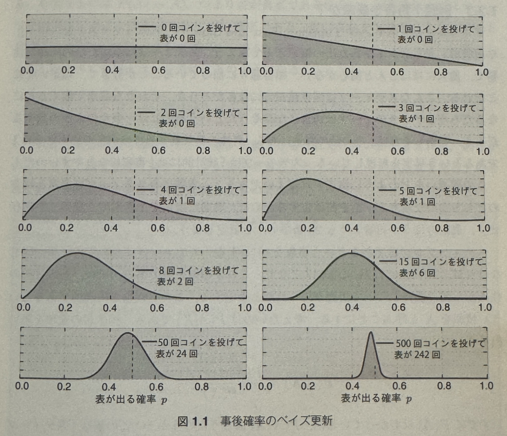

# 1. ベイズ推論の考え方

## 1.1 はじめに

ベイズ推論とは, 新しい証拠が得られるたびに自分の考えを改めるというもの.

ベイズ的に考えるとは, ある結果が必ず起こるとは考えず, 非常に起こりやすいと考える.
全ての可能な場合をチェックしなければ, 絶対にとは言い切れない.

### 1.1.1 ベイズ的な考え方

伝統的な統計的推論とベイズ推論の違いは, 不確実なものは不確実なままにするという点である.

ベイズ主義: 確率を **「ある事象が生じるということがどれくらい確かだと思っているのか」**

頻度主義: 確率の古典的統計学による捉え方
「長期間における事象の頻度」とみなす

ex. 飛行機事故が起こる確率
「長期間における飛行機事故が起きる頻度」

頻度主義的な考え方では, 事象がそれほど発生しない場合は理解が難しくなる.
ex. 大統領選挙で当選する確率

**ベイズ主義における確率では, 思っていることを要約したものだと考える**

- ある事象が発生しないと思っているなら確率は 0
- ある事象が必ず発生すると思っているなら確率は 1

ベイズ主義は, 人によって信念が違うということを定義が許している.

従来の確率論的記法に基づいて, ある事象 $A$ が生じるという信念を $P(A)$ と表し, 事前確率と呼ぶ.
証拠が得られた後に信念を更新するというベイズ主義的な考えに基づいて, X の証拠が与えられた時の $A$ の確率を $P(A|X)$ と表し,
この更新された信念を事後確率という.

### 1.1.2 ベイズ推論の実践

入手できる証拠の数を $N$ とする. $N$ が無限であれば頻度主義とベイズ主義の結果は一致する.
$N$ の小さなものに対しては頻度主義の推定値は分散も信頼区間も大きくなる.

### 1.1.3 頻度主義は間違っているのか？

最小二乗回帰や LASSO 回帰, EM アルゴリズムなどの手法はどれも優れている. ベイズ主義の手法はそれらを補うものである.
頻度主義の手法が使えない場合などにより柔軟なモデリングで隠れた構造を解き明かしたりする.

### 1.1.4 ビッグデータについて

実はビッグデータの解析は比較的単純なアルゴリズムが使われている. 実際はビッグデータを保存し読み出す時や計算量が大変なのである.

もっと難しい問題はミディアムサイズデータの場合で, 特にスモールデータは難しい.

## 1.2 ベイズ推論の枠組み

ここで, ある事象 $A$ についての事前信念があるとする.
ex. テストを実行する前にプログラムがあるかどうかについての信念

次に得られた証拠 $X$ を扱う.
プログラムが全てのテストにパスしたという情報 $X$ を取り入れて信念を更新したい.
この更新された新しい信念を事後信念と呼ぶとする.
以下のベイズの定理で事後信念が計算できる.

$$
P(A|X) = \frac{P(X|A)P(A)}{P(X)}
$$

$$
\propto P(X|A)P(A)
$$

ベイズ推論はこの式を使って事前確率 $P(A)$ と更新後の事後確率 $P(A|X)$ を結びつけているに過ぎない.

### 1.2.1 コイン投げ問題

コインの表が出る確率がわからないと仮定する(正解は 50%). なんらかの比率 $p$ で表が出ることについては信じているとする.
そこでコインを投げ始めて, 表が出たのか裏が出たのかを記録する. (観測データ)

事後確率は曲線で表される.
不確実さは曲線の広がり具合に比例している. データが得られるたびに事後確率の曲線は動き回る.
データがたくさん手に入れば(コインをたくさん投げたら)事後確率曲線は
真の確率である $p=0.5$ に次第に集まる.
実際にコイン投げの結果が極端な場合には, 事後確率は 0.5 から離れてしまう. しかし曲線のピークの位置はいつも 0.5 ではないし, そうである理由もない. $p$ の値は何も知らないと仮定しているから.

### 1.2.2 司書か農家か

スティーブが農家になるか司書になるかについて考える. 話を簡単にするために, 職業には司書と農家の 2 種類しか存在せず, 農家の方が司書よりも 20 倍多いと仮定する.

スティーブが司書であるという事象を $A$ とする. スティーブに関する情報が何もなければ $P(A) = 1/21 = 0.047$ となり, これが事前確率である. では彼の近所の住人から彼の性格について情報が得られたと仮定する. この情報を $X$ と呼ぶことにする. 考えたいのは $P(A|X)$ である.

$$
P(A|X) = \frac{P(X|A)P(A)}{P(X)}
$$

すでに $P(A)$ はわかっているが, $P(X|A)$ はどうだろうか?
これは, 「スティーブが司書であるということが事実な場合に, 近所の住人がスティーブの性格を内向的であると語るのはどのくらいありうるか」という値である.
この値は 1 に近いと考えられる. ここでは 95%としておく.

次は $P(X)$ である. これは誰かが「近所の住人に内向的であると言われる」確率である.
このままではどんな値なのかを考えることは難しいが, 以下のように考えることができる.

$$
P(X) = P(X\cap A) + P(X\cap \bar{A}) \\
= P(X|A)P(A) + P(X|\bar{A})P(\bar{A})
$$

ここで $P(X|\bar{A})$ は「彼が農家である場合に近所の住人がスティーブを内向的であると語る」確率である. これを 0.5 とする.

$$
P(A|X) = \frac{0.95 * 1/21}{0.52} = 0.087
$$

以下は「スティーブが農家である」と「スティーブが司書である」のそれぞれの事前確率と事後確率を比較したものである.
