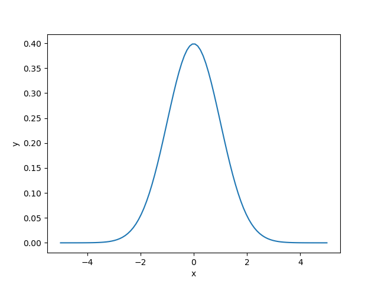
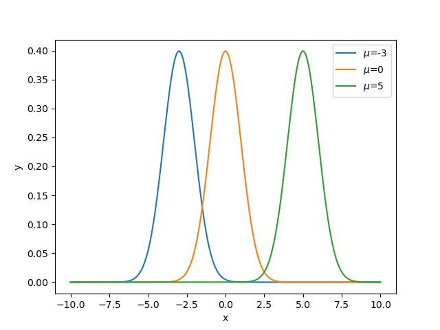
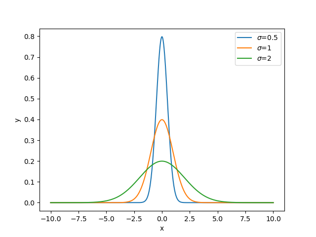
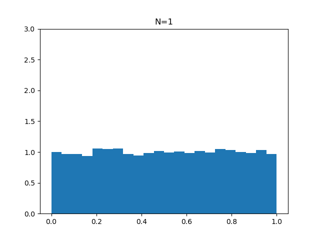
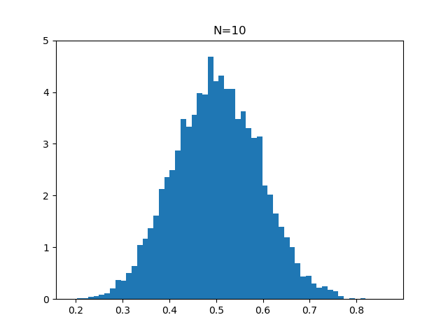
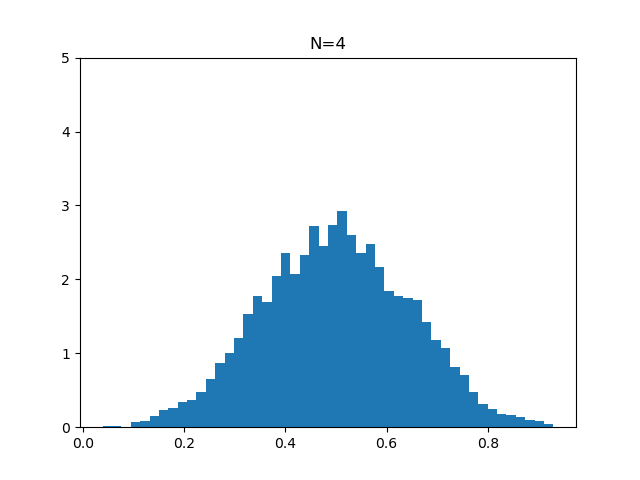

# Step 1 - 正規分布(Normal Distribution)

## 1.1 確率の基礎

### 1.1.1 確率変数と確率分布

**確率変数:** 確率によって決まる変数. サイコロの目など

ここで, サイコロの目を確率変数 $x$ で表し, ある目が出る確率を $p(x)$ とする.

**確率分布:** 起こり得るすべての確率変数に対してその確率が示されたもの.

#### 表 1-1: サイコロの目の確率分布

| サイコロの目 | 確率 |
| ------------ | ---- |
| 1            | 1/6  |
| 2            | 1/6  |
| 3            | 1/6  |
| 4            | 1/6  |
| 5            | 1/6  |
| 6            | 1/6  |

確率分布を元に実際の値が生成される.
確率分布から実際に生成されたデータを**観測値(Observation)**, または単にデータや値という.
観測値の集合を**サンプル(Sample)**や**標本**という.

**確率分布が満たす条件**
$N$ 個の離散値　$x_{1}$, $x_{2}$, ... $x_{N}$ をとる確率変数 $x$　を考える.

1. 各値の発生する確率は全て 0 以上 1 以下
   $$0 \leq p(x_{k}) \leq 1$$
2. 全ての確率の和は 1

   $$\sum_{k=1}^{N}p(x_k) = 1$$

### 1.1.2 確率分布の分類

**離散型確率分布:** 確率変数が離散的な値をとる.


**連続型確率分布** 確率変数が連続的な値をとる.


連続型確率変数の場合, $p(x)$は確率密度を表す. **確率密度関数**ともいう.

連続型確率分布の場合も「確率」を求めることができる.
特定の区間の曲線下の面積に対応する.


また, 連続確率分布も, 確率分布として成立するために次の条件を満たす必要がある.

1. (全ての $x$ において)確率密度は 0 以上
   $$p(x) \ge 0$$
2. 全区間における確率密度の積分は 1

   $$\int_{-\infty}^{\infty}p(x)dx = 1$$

### 1.1.3 期待値と分散

**期待値(Expected Value):** 一回の観測で得られる値の平均値

- 離散型確率分布の場合
  $$\mathbb{E}[x] = \sum_{k=1}^{N}x_{k}p(x_{k})$$
- 連続型確率分布の場合
  $$\mathbb{E}[x] = \int_{\infty}^{\infty}xp(x)dx$$

以下, 期待値を $\mathbb{E}[x]$ と表現する.

期待値は, 得られる可能性のある全ての値とそれが起こる確率の積を足し合わせたものとして表される.

**分散(Variance):**
分散は, 確率変数のとる値が期待値 $\mu$ の周りにどの程度ばらつくかを表す.
分散が小さいほど, 確率変数のとり得る値は期待値の周辺に集まる.

- 離散型確率分布の場合
  $$Var[x] = \mathbb{E}[{(x - \mu)^2}] \\ = \sum_{k=1}^{N}(x_k - \mu)^2p(x_k)$$
- 連続型確率分布の場合
  $$Var[x] = \mathbb{E}[{(x - \mu)^2}] \\ = \int_{-\infty}^{\infty}(x - \mu)^2p(x)dx$$

## 1.2 正規分布(ガウス分布)

### 1.2.1 正規分布の確率密度関数

正規分布は連続型の確率分布. ここでは確率変数 $x$ が, 平均 $\mu$ , 標準偏差 $\sigma$ の
正規分布に従うと仮定する.
この時の正規分布の確率密度関数は

$$
p(x) =　\frac{1}{\sqrt{2\pi}\sigma}\exp({-\frac{(x-\mu)^2}{2\sigma^2}})
$$

確率密度関数は $x$ を引数として確率密度を返す関数.
正規分布の形状は $\mu$ と $\sigma$ で決まる. これらをパラメータという.
このような関係から以下のように記述する.

$$
p(x;\mu, \sigma) =　\frac{1}{\sqrt{2\pi}\sigma}\exp({-\frac{(x-\mu)^2}{2\sigma^2}})
$$

### 1.2.2 正規分布のコード

```Python
import numpy as np

def normal(x, mu=0, sigma=1):
y = 1 / (np.sqrt(2 _ np.pi) _ sigma) _ np.exp(-(x - mu)\*\*2 / (2 _ sigma\*\*2))
return y
```

上記のコードは平均 0, 標準偏差が 1 の正規分布でこれを特に**標準正規分布**と呼ばれている.

```Python
x = np.linspace(-5, 5, 100)
y = normal(x)

plt.plot(x, y)
plt.xlabel('x')
plt.ylabel('y')
plt.savefig(img_path)
plt.show()
```



### 1.2.3 パラメータの役割

標準偏差を固定し, $\mu$ を変化させる.



平均を固定し, $\sigma$ を変化させる.



標準偏差を変更すると山の形が変化し, 平均を変更すると最大値の位置が変化する.

## 1.3 中心極限定理

### 1.3.1 中心極限定理とは

ある確率変数 $x$ が確率分布 $p(x)$ に従うと仮定する.
(この確率分布は任意で構わない)
次にこの分布からランダムに $N$ 個のサンプルを取り平均をとる.
これを **サンプル平均(標本平均)** という.
サンプル平均 $\mu$, 分散 $\sigma^2$

$$
{x^{(1)}, x^{(2)},..., x^{(N)}}
$$

$$
\bar{x} = \frac{x^{(1)}+x^{(2)}+...+x^{(N)}}{N}
$$

サンプル平均をとる操作の回数を増やしていくと, サンプル平均の分布は正規分布に近づく. これを **中心極限定理** という.

### 1.3.2 中心極限定理の実証

matplotlib, numpy を用いて一様分布から乱数を生成し, 中心極限定理を実証する.

```Python
def sample_avg(size, num_sampling):
    x_means = []
    for _ in range(num_sampling):
        xs = []
        for i in range(size):
            x = np.random.rand()
            xs.append(x)
        mean = np.mean(xs)
        x_means.append(mean)

    plt.hist(x_means, bins='auto', density=True)
    # if density is True, return probability density
    plt.ylim(0, 3)
    plt.title(f'N={size}')
    plt.show()
```

`size`は標本平均をとるためにサンプリングした数. `num_sampling`はサンプリング平均をした数.



`size`が $1$ の時は一様分布を示している. これをさらに増やしていく.



`size`が $10$ になると正規分布らしくなっていくのがわかる.
さらに`size`が $4$ の時をプロットして比較すると, `size`を増やせば正規分布の山が段々と鋭くなる(分散が小さくなる)のがわかる.



## 1.4 サンプル和の確率分布
