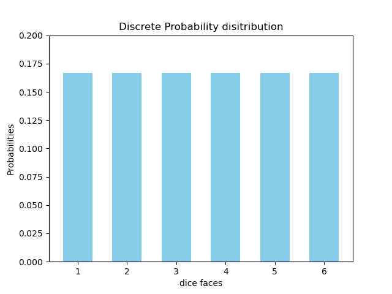
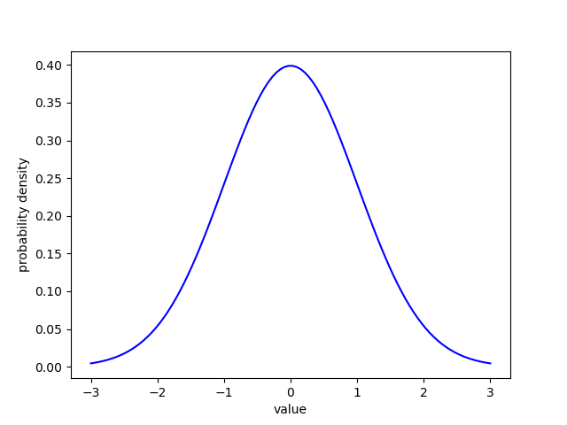
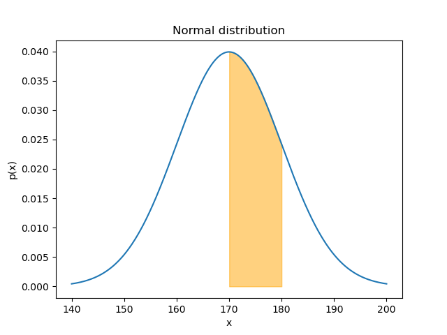

# Step 1 - 正規分布(Normal Distribution)

## 1.1 確率の基礎

### 1.1.1 確率変数と確率分布

**確率変数:** 確率によって決まる変数. サイコロの目など

ここで, サイコロの目を確率変数 $x$ で表し, ある目が出る確率を $p(x)$ とする.

**確率分布:** 起こり得るすべての確率変数に対してその確率が示されたもの.

#### 表 1-1: サイコロの目の確率分布

| サイコロの目 | 確率 |
| ------------ | ---- |
| 1            | 1/6  |
| 2            | 1/6  |
| 3            | 1/6  |
| 4            | 1/6  |
| 5            | 1/6  |
| 6            | 1/6  |

確率分布を元に実際の値が生成される.
確率分布から実際に生成されたデータを**観測値(Observation)**, または単にデータや値という.
観測値の集合を**サンプル(Sample)**や**標本**という.

**確率分布が満たす条件**
$N$ 個の離散値　$x_{1}$, $x_{2}$, ... $x_{N}$ をとる確率変数 $x$　を考える.

1. 各値の発生する確率は全て 0 以上 1 以下
   $$0 \leq p(x_{k}) \leq 1$$
2. 全ての確率の和は 1

   $$\sum_{k=1}^{N}p(x_k) = 1$$

### 1.1.2 確率分布の分類

**離散型確率分布:** 確率変数が離散的な値をとる.

**連続型確率分布** 確率変数が連続的な値をとる.

連続型確率変数の場合, $p(x)$は確率密度を表す. **確率密度関数**ともいう.

連続型確率分布の場合も「確率」を求めることができる.
特定の区間の曲線下の面積に対応する.

また, 連続確率分布も, 確率分布として成立するために次の条件を満たす必要がある.

1. (全ての $x$ において)確率密度は 0 以上
   $$p(x) \ge 0$$
2. 全区間における確率密度の積分は 1

   $$\int_{-\infty}^{\infty}p(x)dx = 1$$

### 1.1.3 期待値と分散

**期待値(Expected Value):** 一回の観測で得られる値の平均値

- 離散型確率分布の場合
  $$\mathbb{E}[x] = \sum_{k=1}^{N}x_{k}p(x_{k})$$
- 連続型確率分布の場合
  $$\mathbb{E}[x] = \int_{\infty}^{\infty}xp(x)dx$$

以下, 期待値を$\mathbb{E}[x]$と表現する.

期待値は, 得られる可能性のある全ての値とそれが起こる確率の積を足し合わせたものとして表される.

**分散(Variance):**
分散は, 確率変数のとる値が期待値$\mu$の周りにどの程度ばらつくかを表す.
分散が小さいほど, 確率変数のとり得る値は期待値の周辺に集まる.

- 離散型確率分布の場合
  $$Var[x] = \mathbb{E}[{(x - \mu)^2}] \\ = \sum_{k=1}^{N}(x_k - \mu)^2p(x_k)$$
- 連続型確率分布の場合
  $$Var[x] = \mathbb{E}[{(x - \mu)^2}] \\ = \int_{-\infin}^{\infin}(x - \mu)^2p(x)dx$$
