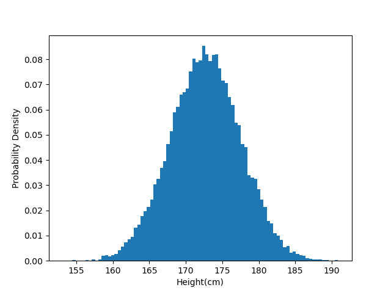
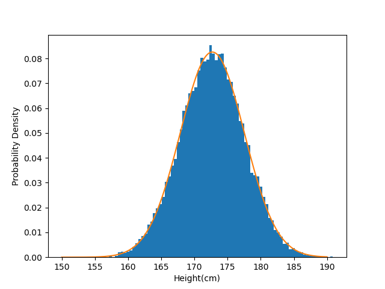

# 2 最尤推定

正規分布に似た分布に対して正規分布を適合させる(フィットさせる)方法のことを最尤推定(Maximum Likelihood Estimation)という.

## 2.1 生成モデルの概要

### 2.1.1 生成モデルとは

生成モデルの目標: あるデータ $x$ の確率分布 $p(x)$ をモデル化すること.

例えば身長の分布を正規分布でフィッティングする場合, 正規分布のパラメータ( $\mu$ , $\sigma$ )を推定する必要がある.

### 2.1.2 母集団とサンプル

母集団: 対象となる全体の集合を指す
統計学では母集団から限られたサンプルを取り出し, そのサンプルから母集団を推定することをいう.
母集団の真の確率分布(母集団分布)を知ることはできない

以下の 2 つの手順で推定を行う.

1. モデル化: **真の確率分布(母集団分布)がパラメータ調整可能な確率分布で近似されると仮定する**
2. パラメータ推定: 仮定したモデルがサンプルにフィットするようにパラメータを推定する.

2 つ目の手順で最尤推定を用いる.

## 2.2 実データを使った生成モデルの実装

### 2.2.1 身長データセットの読み込み

height.txt を読み込み表示する



正規分布のような形をしていることから身長の確率分布を正規分布としてモデル化する.

### 2.2.2 正規分布による生成モデル

1. モデル化：身長分布が正規分布であると仮定する.
2. パラメータ推定：サンプルを元に正規分布のパラメータを推定する.

最尤推定によってサンプルの平均と標準偏差として求められる

```Python
mu = np.mean(xs)
sigma = np.std(xs)
print(mu)
print(sigma)
```

実行結果
`172.70250853667997
4.830167473396299`

先ほどのヒストグラムに対してサンプルの標準偏差と平均を用いた正規分布を合わせてプロットする.


