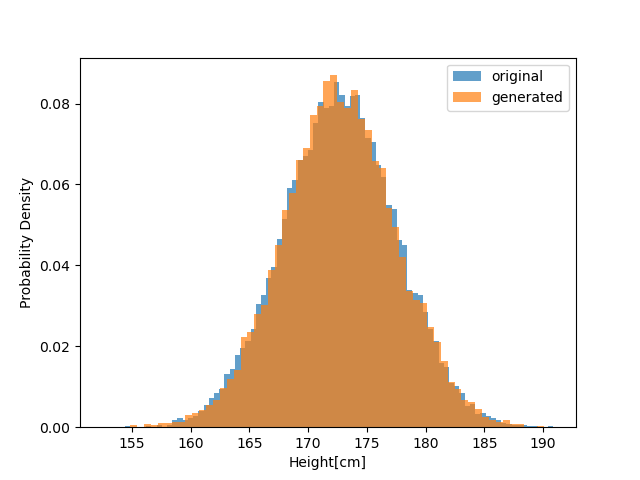

# 2 最尤推定

正規分布に似た分布に対して正規分布を適合させる(フィットさせる)方法のことを最尤推定(Maximum Likelihood Estimation)という.

## 2.1 生成モデルの概要

### 2.1.1 生成モデルとは

生成モデルの目標: あるデータ $x$ の確率分布 $p(x)$ をモデル化すること.

例えば身長の分布を正規分布でフィッティングする場合, 正規分布のパラメータ( $\mu$ , $\sigma$ )を推定する必要がある.

### 2.1.2 母集団とサンプル

母集団: 対象となる全体の集合を指す
統計学では母集団から限られたサンプルを取り出し, そのサンプルから母集団を推定することをいう.
母集団の真の確率分布(母集団分布)を知ることはできない

以下の 2 つの手順で推定を行う.

1. モデル化: **真の確率分布(母集団分布)がパラメータ調整可能な確率分布で近似されると仮定する**
2. パラメータ推定: 仮定したモデルがサンプルにフィットするようにパラメータを推定する.

2 つ目の手順で最尤推定を用いる.

## 2.2 実データを使った生成モデルの実装

### 2.2.1 身長データセットの読み込み

height.txt を読み込み表示する


正規分布のような形をしていることから身長の確率分布を正規分布としてモデル化する.

### 2.2.2 正規分布による生成モデル

1. モデル化：身長分布が正規分布であると仮定する.
2. パラメータ推定：サンプルを元に正規分布のパラメータを推定する.

最尤推定によってサンプルの平均と標準偏差として求められる

```Python
mu = np.mean(xs)
sigma = np.std(xs)
print(mu)
print(sigma)
```

実行結果
`172.70250853667997
4.830167473396299`

先ほどのヒストグラムに対してサンプルの標準偏差と平均を用いた正規分布を合わせてプロットする.


## 2.3 最尤推定の理論

先ほどの事例ではサンプルから正規分布のパラメータを推定した.
具体的には以下の通り.

$$
\hat{\mu} = \frac{1}{N}\sum_{n=1}^{N}x^{(n)}
$$

$$
\hat{\sigma} = \sqrt{\frac{1}{N}\sum_{n=1}^{N}(x^(n) - \hat{\mu})^2}
$$

推定した値にはハットをつけることにする.

### 2.3.1 尤度の最大化

パラメータ $\theta$ によって形状が決まる確率分布があるとき, データ $x$ が得られる確率密度は
$p(x; \theta)$

サンプル 1-N が先ほどの確率密度に従って**独立に**生成されると仮定すると

$$
p(D;\theta) = p(x^{(1)};\theta) p(x^{(2)};\theta)...p(x^{(N)};\theta)
$$

またこの　$p(D;\theta)$ はパラメータ $\theta$ を引数としてデータサンプル D を生成する関数として定義できる.

$$
L(\theta) = p(D; \theta)
$$

この $L(\theta)$ は**尤度(likelihood), 尤度関数(likelihood function)**という.

最尤推定は, 尤度 $ p(D; \theta)$ を最大化するパラメータ $\theta$ を見つける手法.
最大化するパラメータ $\theta = \hat{\theta}$ であるときモデルがサンプルに最もフィットする.

最尤推定は尤度の対数を最大化することが多い(計算の利便性)

### 2.3.2 微分を使って最大値を探す

省略

### 2.3.3 正規分布の最尤推定

正規分布の式

$$
N(x;\mu, \theta) = \frac{1}{\sqrt{2\pi}\sigma}\exp\left(-\frac{(x-\mu)^2}{2\sigma^2}\right)
$$

ここで n 個のサンプルが得られたとしてそれが正規分布に従うと仮定する.
この時の尤度は

$$
p(D;\mu, \sigma) = \prod_{n=1}^{N}\frac{1}{\sqrt{2\pi}\sigma}\exp\left(-\frac{(x^{(n)}-\mu)^2}{2\sigma^2}\right)
$$

ここから対数尤度を求める.

$$
\log{p(D;\mu, \sigma)} = \log{\prod_{n=1}^{N}\frac{1}{\sqrt{2\pi}\sigma}\exp\left(-\frac{(x^{(n)}-\mu)^2}{2\sigma^2}\right)}
$$

$$
= \log{\prod_{n=1}^{N}\frac{1}{\sqrt{2\pi}\sigma}} + \log{\prod_{n=1}^{N}\exp\left(-\frac{(x^{(n)}-\mu)^2}{2\sigma^2}\right)}
$$

$$
= \log\left(\frac{1}{\sqrt{2\pi}\sigma}\right)^{N} + \sum_{n=1}^{N}-\frac{(x^{(n)}-\mu)^2}{2\sigma^2}
$$

$$
= -\frac{N}{2}\log{2\pi\sigma^2} - \frac{1}{2\sigma^2}\sum_{n=1}^{N}(x^{(n)}-\mu)^2
$$

ここで最後の式の $\mu$ に注目すると, **対数尤度は $\mu$ の 2 次関数である**ことがわかる.

この 2 次関数は係数が負であるため微分が 0 の場所に最大値が存在する.

$L(\mu;\sigma) = \log{p(D;\mu, \sigma)}$ と定義すると, $\frac{\partial L}{\partial \mu}$ は

$$
\frac{\partial L}{\partial \mu} = \frac{1}{\sigma^2}\sum_{n=1}^{N}(x^{(n)} - \mu)
$$

これが 0 である時の $\mu$ を計算する.

$$
\frac{1}{\sigma^2}\sum_{n=1}^{N}(x^{(n)} - \mu) = 0
$$

$$
\Leftrightarrow \sum_{n=1}^{N}(x^{(n)} - \mu) = 0
$$

$$
\Leftrightarrow \sum_{n=1}^{N}\mu = \sum_{n=1}^{N}x^{(n)}
$$

$$
\Leftrightarrow N\mu = \sum_{n=1}^{N}x^{(n)}
$$

$$
\therefore \mu = \frac{1}{N}\sum_{n=1}^{N}x^{(n)}
$$

つまり正規分布の平均はサンプル平均である時に対数尤度が最大になる.

$\sigma$ についても, $\mu = \hat{\mu}$ であるという条件のもとで $\sigma$ について微分すれば解析的に求められる.

すると

$$
\hat{\sigma} = \sqrt{\frac{1}{N}\sum_{n=1}^{N}(x^{(n)}-\hat{\mu})^2}
$$

と求められる.

## 2.4 生成モデルの用途

先ほど推定したパラメータを用いたモデルで何ができるか？

### 2.4.1 新しいデータの生成



新たなデータを 10000 生成して, 実際のデータと同時にプロットした.
これは単純な一次元データでの生成だが, 2 次元画像データなどを生成するには
モデルを大量に学習させることで可能になる.

### 2.4.2 確率の計算

確率分布がわかれば, ある値がどれほど起こりやすいかがわかる.
これは確率密度関数の積分で定義される.

Scipy ライブラリには, 正規分布の積分を解析的に求める関数が用意されている.

累積分布関数を求める関数である.

$$
F(x) = \int_{-\infty}^{x}f(t)dt
$$

```Python
scipy.stats.norm.cdf(x, loc=0, scale=1)
```

x: x 以下が発生する確率をプロットする
loc: 平均
scale: 標準偏差

```Python
import os
import numpy as np
from scipy.stats import norm

path = os.path.join(os.path.dirname(__file__), 'height.txt')
xs = np.loadtxt(path)

mu = np.mean(xs)
sigma = np.std(xs)

p1 = norm.cdf(160, loc=mu, scale=sigma)
print('p(x <= 160):', p1)

p2 = norm.cdf(180, loc=mu, scale=sigma)
print('p(x > 180):', 1-p2)
```

実行結果
p(x <= 160): 0.004271406830855
p(x > 180): 0.06541774339950823

ドアの高さを何センチにしたら何%の人間が通れるかなどというように定量的に評価できる.
