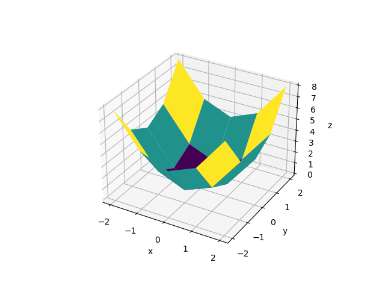
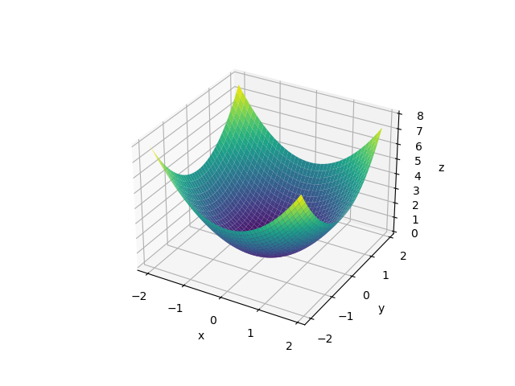
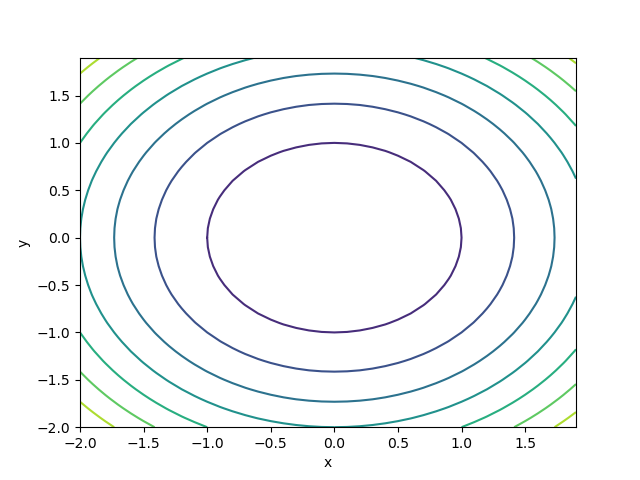
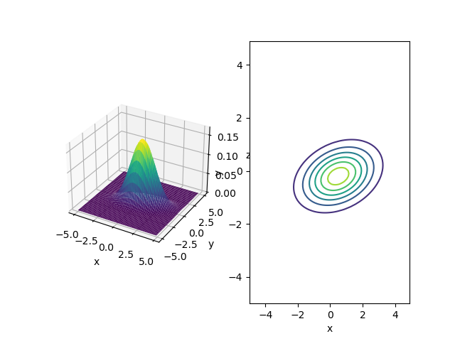

# 3. 多次元正規分布

## 3.1 Numpy と多次元配列

```Python
import numpy as np
x = np.array([1, 2, 3])

print(x.__class__)  # クラス名
print(x.shape)  # 形状
print(x.ndim)   # 次元数
```

要素ごとの演算を行う. 積はアダマール積と呼ばれる。
通常のベクトル積や行列積は np.dot で行う。

```Python
a = np.array([1, 2, 3])
b = np.array([4, 5, 6])
y = np.dot(a, b)
print(y)

A = np.array([[1, 2], [3, 4]])
B = np.array([[5, 6], [7, 8]])
Y = np.dot(A, B)
print(Y)
```

## 3.2 多次元正規分布

観測値が複数の実数値(ベクトル)である時の正規分布

### 3.2.1 多次元正規分布の式

確率変数を次のように定義する.

$$
\bm{x} = \begin{pmatrix}x_1 \\ x_2 \\ \vdots \\ x_D \end{pmatrix}
$$

x の要素は同じ分布からの D 個のサンプルではなく各要素は互いに関連するデータである(身長と体重のように)
この時, この $\bm{x}$ に関する正規分布は

$$
\mathcal{N}(\bm{x};\mu, \Sigma) = \frac{1}{\sqrt{(2\pi)^{D}|\Sigma|}}\exp{\lbrace -\frac{1}{2}(x - \mu)^\top \Sigma^{-1}(x-\mu)\rbrace}
$$

$\bm{\mu}$ と $\Sigma$ に注目する.
$\bm{\mu}$ は**平均値ベクトル**, $\Sigma$ は**共分散行列**と呼ばれる.

これらは次の要素からなる.

$$
\bm{\mu} = \begin{pmatrix} \mu_1 \\ \mu_2 \\ \vdots \\ \mu_D\end{pmatrix}
$$

$$
\Sigma =
\begin{pmatrix}
\sigma_{11} & \sigma_{12} & \dots & \sigma_{1D} \\
\sigma_{21} & \sigma_{22} & \dots & \sigma_{2D} \\
\vdots & \vdots & \ddots & \vdots \\
\sigma_{D1} & \sigma_{D2} & \dots & \sigma_{DD}
\end{pmatrix}
$$

今回は D 次元のデータが対象であるため平均ベクトルは D 個の要素から成る.
共分散行列は対角成分が各変数の分散を表し, 非対角成分は各変数間の共分散を表す.

#### 共分散

確率変数 $x_i$ の分散は以下の式で求められる.

$$
Var[x_i] = \mathbb{E}[(x_i - \mu_i)^2]
$$

共分散は分散の一般化である. 確率変数 $x_i$ と $x_j$ の共分散を $Cov[x_i, x_j]$ とする.

$$
Cov[x_i, x_j] = \mathbb{E}[(x_i - \mu_i)(x_j - \mu_j)]
$$

#### 転置

共分散行列は転置しても同じ行列になる. このような行列を**対称行列**という.

#### 逆行列

行列式が 0 でない場合に存在し, 元の行列との積が単位行列になる.

### 3.2.2 多次元正規分布の実装

$$
\mathcal{N}(\bm{x};\mu, \Sigma) = \frac{1}{\sqrt{(2\pi)^{D}|\Sigma|}}\exp{\lbrace -\frac{1}{2}(x - \mu)^\top \Sigma^{-1}(x-\mu)\rbrace}
$$

```Python
import numpy as np
def multivariate_normal(x, mu, cov):
    det = np.linalg.det(cov)
    inv = np.linalg.inv(cov)
    D = len(x)
    z = 1 / np.sqrt((2 * np.pi) ** D * det)
    y = z * np.exp((x - mu).T @ inv @ (x - mu) / -2.0)
    return y
```

## 3.3 2 次元正規分布の視覚化

### 3.3.1 3D グラフの描画方法



meshgrid を用いて-2 から 2 を 0.1 単位で格子作成



ax.plot_surface は表面を描画する.
等高線を描画するには contour を利用する.



### 3.3.3 2 次元正規分布のグラフ

$$
\mathcal{N}(\bm{x};\mu, \Sigma) = \frac{1}{\sqrt{(2\pi)^{D}|\Sigma|}}\exp{\lbrace -\frac{1}{2}(x - \mu)^\top \Sigma^{-1}(x-\mu)\rbrace}
$$

コードは以下の通り.

```Python
import numpy as np
import matplotlib.pyplot as plt
def multivariate_normal(x, mu, cov):
    det = np.linalg.det(cov)
    inv = np.linalg.inv(cov)
    D = len(x)
    z = 1 / np.sqrt((2 * np.pi) ** D * det)
    y = z * np.exp((x - mu).T @ inv @ (x - mu) / -2.0)
    return y

mu = np.array([0.5, -0.2])
cov = np.array([[2.0, 0.3],
                [0.3, 0.5]])
xs = ys = np.arange(-5, 5, 0.1)
X, Y = np.meshgrid(xs, ys)
Z = np.zeros_like(X)

for i in range(X.shape[0]):
    for j in range(X.shape[1]):
        x = np.array([X[i, j], Y[i, j]])
        Z[i, j] = multivariate_normal(x, mu, cov)

fig = plt.figure()
ax1 = fig.add_subplot(1, 2, 1, projection='3d')
ax1.set_xlabel('x')
ax1.set_ylabel('y')
ax1.set_zlabel('z')
ax1.plot_surface(X, Y, Z, cmap='viridis')

ax2 = fig.add_subplot(1, 2, 2)
ax2.set_xlabel('x')
ax2.set_ylabel('y')
ax2.contour(X, Y, Z)
plt.show()
```



共分散行列を変更した時にどのような変化があるか調べる.
