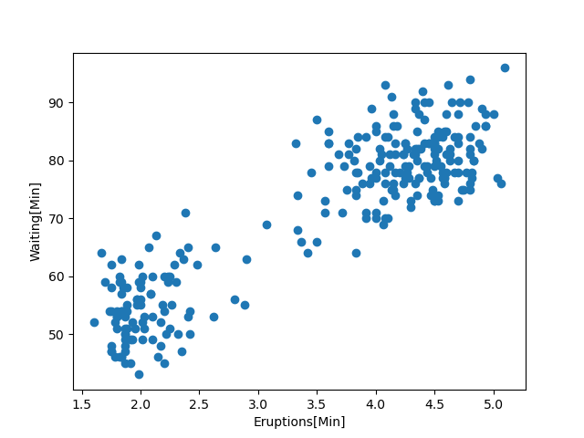
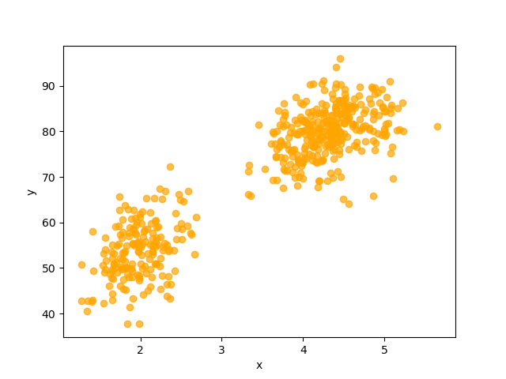

# 4. 混合ガウスモデル

## 4.1 身の回りにある多峰性分布

**男女混合の身長の分布**
年齢と性別を限定した場合に正規分布になることが知られているが, 性別を限定しない場合はどうか？

男女で二つの山が存在することになる(二つの分布が存在する)

**アリの体長**
アリをサンプリングして体長を記録していくと多峰性分布になる(役割によってサイズが異なるから)

**間欠泉の噴出**
4.1.1 で用いる

### 4.1.1 多峰性分布のデータセット

```Python
import os
import numpy as np

path = os.path.join(os.path.dirname(__file__), 'old_faithful.txt')
xs = np.loadtxt(path)
print(xs.shape)
print(xs[0])
```

(272, 2)
[ 3.6 79. ]

データセットは np.ndarray として読み込まれる. 1 つ目のデータは噴出した時間が 3.6 分であり, 次の噴出までの間隔が 79 分だったことを示す.

散布図に示す.



## 4.2 混合ガウスモデルのデータ生成

複数の正規分布からなるモデルは**混合ガウスモデル**と呼ばれる.

1. モデル化: 観測データの分布が GMM によって表現できると仮定する
2. パラメータ推定: GMM のパラメータ推定を行う.

### 4.2.1 GMM によるデータ生成

1. 2 の正規分布の中から, ある確率分布に従って 1 つを選ぶ
2. 選んだ正規分布からデータを生成する

   この手順でデータを生成するコードをかく

### 4.2.2 データ生成を行うコード

```Python
import numpy as np
import matplotlib.pyplot as plt
# ====== 学習済パラメータ ======
# 平均行列(0: 1つ目の平均, 1: 2つ目の平均)
mus = np.array([[2.0, 54.50],
                [4.3, 80.0]])
# 共分散行列の行列
covs = np.array([[[0.07, 0.44],
                 [0.44, 33.7]],
                 [[0.17, 0.94],
                  [0.94, 36.00]]])
# 各正規分布が選ばれる確率
phis = np.array([0.35, 0.65])
# ===========================

def sample():
    z = np.random.choice(2, p=phis)
    mu, cov = mus[z], covs[z]
    x = np.random.multivariate_normal(mu, cov)
    return x

N = 500
xs = np.zeros((N, 2))
for i in range(N):
    xs[i] = sample()

# print(xs)
plt.scatter(xs[:, 0], xs[:, 1], color='orange', alpha=0.7)
plt.xlabel('x')
plt.ylabel('y')
plt.show()
```

生成されるデータは以下のような散布図になる.
二つの正規分布に従っている.



## 4.3 混合ガウスモデルの式

### 4.3.1 確率の復習

確率変数 $x, y$ がある時, $p(x,y)$ は $x, y$ が同時に起こる確率で**同時確率**と呼ばれる.
一方, $p(x), p(y)$ は**周辺確率**と呼ばれる.

同時確率から特定の周辺確率を求めることを**周辺化**という.
$y$ が離散の場合

$$
p(x) = \sum_{y}p(x, y)
$$

連続の場合

$$
p(x) = \int{p(x,y)dy}
$$

条件付き確率: ある条件下での確率を表す.
以下を**乗法定理**という.

$$
p(x, y) = p(x | y)p(y) = p(y | x)p(x)
$$

### 4.3.2 GMM の式

**GMM のデータ生成手順**

- K 個の正規分布の中からある確率に従って 1 つを選ぶ
- 選んだ正規分布からデータを生成する

K 個の正規分布から選ぶ行為に用いる確率分布はカテゴリカル分布によって表される.

$$
p(z=k;\phi) = \phi_{k}
$$

$z$ は離散型の確率変数で, 1 から K の間の整数 $k$ をとる. $\bm{\phi} = (\phi_{1}, \phi_{2}, \dots, \phi_{K})$ は k 番目の正規分布が出現する確率に対応する.

次に複数の正規分布を数式で表す.

$$
\bm{\mu} = \lbrace \bm{\mu}_1, \bm{\mu}_2, \dots, \bm{\mu}_K \rbrace
$$

$$
\Sigma = \lbrace \Sigma_1, \Sigma_2, \dots, \Sigma_K \rbrace
$$

例えば $K$ 個の正規分布が用意されたとき, $z$ のとる値によって使われる正規分布が決まる.
$z=k$ の時は, $x$ の従う確率分布は $k$ 番目の正規分布になる.

$$
p(\bm{x}|z = k;\bm{\mu}, \Sigma) = \mathcal{N}(\bm{x};\bm{\mu}_k,\Sigma_k)
$$

左辺は $z=k$ のときの k 番目の確率分布に従った時の観測データの条件付き確率.
右辺は $z=k$ の多次元正規分布を表す.

生成モデルの目標は, 観測データ $x$ の確率分布 $p(x)$ を表すこと.
