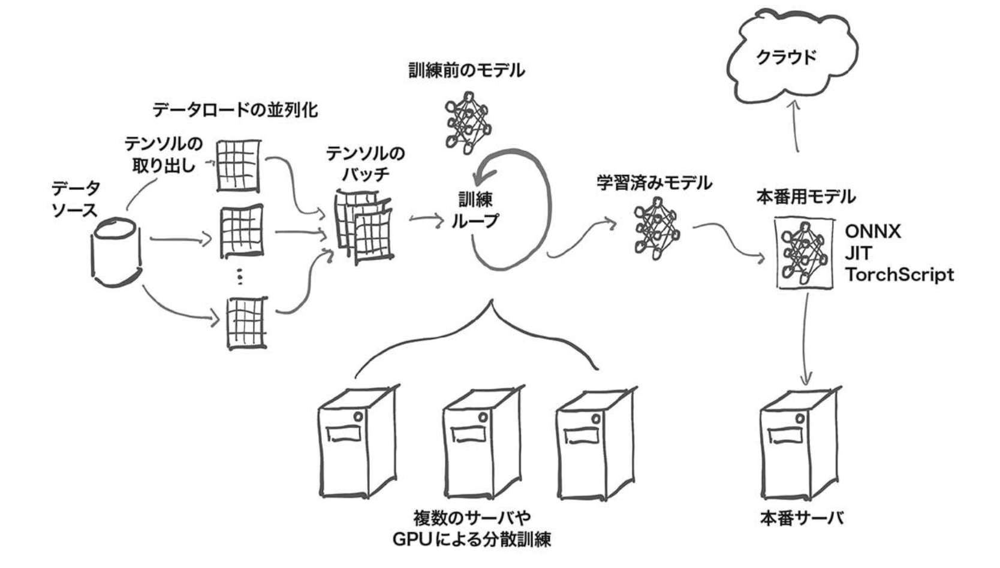

# ディープラーニングと PyTorch の概要

## 1.1 ディープラーニングによる革命

ディープラーニングは特徴量エンジニアリングを自動で行う
(特徴量エンジニアリングをしなくていいわけではない)

**必要なこと**

- 手元にあるデータをディープラーニングマシンに投入する方法
- ディープラーニングマシンを定義する
- 有用な特徴量を獲得し, マシンから望ましい出力を得る自動的な訓練方法が必要

## 1.2 PyTorch とは

PyTorch は Python のライブラリの一つで, ディープラーニングモデルを
Python の慣用的なクラスや関数の扱い方で実装でき, 柔軟性を重視した設計になっている.

**デバッグのしやすさ, 明確な構文のルール, 合理的な API 設計(PyTorch の API=関数)**

ディープラーニングマシンは基本的に入力を出力に変換する複雑な数学的関数.
そのため, PyTorch ではデータを Tensor(テンソル)という形で扱う.

Tensor は numpy 配列と多くの類似点を持つ多次元配列.

## 1.3 なぜ PyTorch を利用するのか

- 実装がシンプル
- GPU を用いた計算の高速化に対応
- 訓練時に利用する損失関数の数値最適化を支援する機能がある

## 1.4 ディープラーニングにおける PyTorch の役割

PyTorch は Python 以外のコードがたくさん含まれている.(C++と CUDA を用いる)
CUDA とは **Nvidia 製の C++のような言語**で, GPU 上で大規模な並列処理を行うためのコンパイルが可能.

Python の様々な API を利用できる点でも PyTorch は重要である.
Tensor を操作する torch モジュールのライブラリも充実していて, Tensor の演算は CPU, GPU 問わず利用できる.

Tensor に対して実行された計算を追跡し, 計算結果の出力テンソルの導関数を,
各入力のテンソルに対して解析的に計算する機能も備わっている.
autograd エンジンを利用してこの機能を呼び出す関数が備わっている(勾配計算がしやすい)

上図は, データをロードし, モデルを訓練して, そのモデルを本番環境にデプロイする流れを示す.

ニューラルネットを構築するための PyTorch のコアモジュールは`torch.nn`で,
このモジュールは NN レイヤーやその他のアーキテクチャ, コンポーネントを提供する.

`torch.nn`には全結合層(FC), 畳み込み層(Conv), 活性化関数(activation), 損失関数(Loss)の全てが含まれている.

モデルの訓練のためにはそのほかにも訓練データの読み込み元ソース, 訓練データに適応するための optimizer, モデルの訓練を実行するハードに対してモデルとデータを渡す手段が必要.

訓練データがモデルに到達する前にデータ処理が必要. そもそもデータをソースから取得する必要がある.
データ(形式を問わない)からテンソルへの橋渡しをするのが, `torch.utils.data`にある Dataset クラス.

元からあるデータに応じて必要な処理が変わるため, Dataset クラスを用いたデータソーシングの過程は各々実装する必要がある.

ストレージからのデータの読み込みは時間がかかるため, 並列的に処理したい...
複数サンプルを含むテンソルである batch を作成するために, 並列処理でデータをロードするために`DataLoader`クラスが備わっている

DataLoader クラスのインスタンスは子プロセスを生成し, バックグラウンドでデータセットからデータをロードできる.
つまり, 訓練ループの準備が出来次第, バッチでの訓練が可能になる.

訓練過程では, データローダーから取得したサンプルのバッチに対してモデルの出力を計算.
次に何らかの損失関数を使用して, モデルの出力と所望の出力を比較する.
ここで autograd を用いて`torch.optim`で指定した手法でモデルが最適化される.
